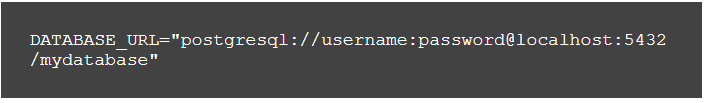

# PRISMA ORM

Prisma ORM is a modern database management tool that acts as a bridge between application code and databases.

It generates a type-safe client that allows you to interact with your database without writing SQL queries manually.

It's **key features** are:
- Type-safe data querying and manipulation
- Automated database migrations

It is optimized for JavaScript and TyeScript projects.

It supports the databases below:
- PostgreSQL
- MySQL
- SQLite
- MongoDb

## Key Advantages of Prisma ORM
1. **Type-Safety with TypeScript**

- Automatically generates TypeScript types from your database schema, enabling compile-time validation and reducing runtime errors.

2. **Easy Databade Migrations**

- Simplifies schema changes through declarative migrations managed via Prisma schema files.

3. **Auto-Generated Query Client**

- Provides intuitive, abstraction layer over SQL with methods like ```findUnique()``` and ```create()```, allowing focus on business logic.

4. **Multi-Database Support**

- Prisma supports a wide range of databases, including PostgreSQL, MySQL, SQLite, and MongoDB. Enabling flexible database switching.

5. **Improved Developer Experience**

- Includes tools like Prisma Studio for visual data management and automatic relation handling.

## How to Use Prisma ORM: A Step-by-Step Guide
Let’s walk through how to set up and use Prisma in our Node.js project:

### step 1: Install Prisma
First, Initialize a Node.js project if you haven't already:
```bash
npm init -y
npm install prisma -D
```

Next, initialize Prisma:
```bash
npx prisma init --datasource-provider DATABASE
```
Replace **DATABASE** with the database you're using.

This command creates ```schema.prisma``` (models) and ```.env``` (connection string) files.

### Step 2: Define the Database Schema
In ```schema.prisma```file, define your data models.

Models represent database tables and their relationships in an intuitive, developer friendly way.

Each model consists of **fields** that map to database columns.

Fields are made up of 4 different parts: 
- **Field name:** (required, eg product Title)

- **Data type:** (required, eg String, boolean, Integer)
- **Field type modifier:** (optional, we use **?**)
- **Attributes:** (optional, they start with **@** symbol.)

#### Field Attributes
- **@:** It marks the field as primary key
- **@default:** It sets default value. eg, @default(now())

- **@unique:** It ensures a field has unique values.
- **@updatedAt:** It auto-updates timestamp whenever record is updated.
- **@map:** It maps the field to a different column name. eg, firstName @map("first_name")
- **@relation:** It defines relationships between models.
- **@@id:** a model attribute that defines a composite primary key. eg, @@id([field1, field2])
- **@@unique:** a model attribute that ensures  a composite unique constraint on multiple fields. 
- **@@map:** a model attribute that maps a model to different table name.

Here is an example with a Blog post model:
```prisma
model BlogPost {
  id        Int      @id @default(autoincrement())
  title     String   @db.VarChar(120)
  content   String   @db.Text
  createdAt DateTime @default(now()) @map("created_at")
  isDraft   Boolean  @default(true) @map("is_draft")
  @@map("blog_posts")
}
```

### Step 3: Connect to the Database
In the ```.env``` file, define your database connection string:



### Step 4: Run Migrations
Run the migration to apply the schema to your database:

```bash
npx prisma migrate dev --name MIGRATION-NAME
```

### Step 5: Generate Prisma Client
Prisma will generate a type-safe client based on your schema:

```bash
npx prisma generate
```

During migrations, ```@prisma/client``` package should be installed automatically to help you in working with prisma client.

If it is not already installed, run the command:
```bash
npm install @prisma/client
```

## CRUD Operations
### Create
- ```create()```: creates a single record

- ```createMany()```: creates multiple records.
- ```createManyAndReturn()```: returns objects only.

### Read
- ```findMany()```: gets all records

- ```findFirst()```: gets the first record that matches a criteria and applies the filter using ```where```
- ```select```: used to specify the fields you want returned.

### Update
- ```update()```: updates a single record

- ```updateMany()```: updates multiple records

### Delete
- ```delete()```: deletes a single record

- ```deleteMany()```: deletes multiple records

## Relationships
Relationships define how database tables (models) connect to each other. 

### Relationship Types
- **one-to-one relationship (1-1):** one record in a table is associated to only one record in another table.

- **one-to-many relationship (1-n):** one record in a table can be associated with multiple other records in another table.

- **many-to-many relationship (m-n):** multiple records in one table can be associated to multiple records in another table.


